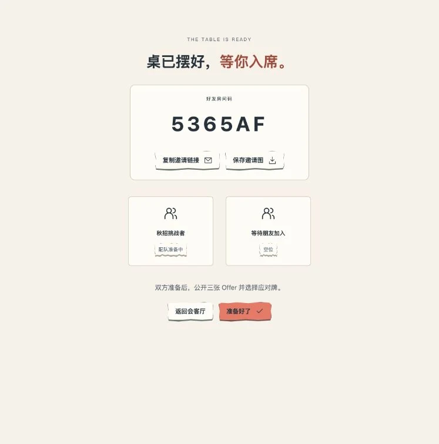

<div align="center">

# 秋招斗兽棋 · Offer Battle

### 工资先亮，底牌后出。

把你的 Offer 变成角色，和朋友打一局。<br>
一款原创纸艺风策略卡牌游戏，在浏览器里直接开打。

**[▶ 免费试玩](https://weikezhang.cn/offer-battle/)** · **[30 秒实机与图文介绍](https://weikezhang.cn/offer-battle/about/)** · **[本地运行](#本地运行)**

`2.2 公测`　`单人练习 / 好友联机`　`桌面 / 手机`

[](https://weikezhang.cn/offer-battle/about/#film)

*工资之外，还有底牌。点击画面，看看实机。*

</div>

## 一张牌桌，四个位置。你准备出哪一手？

- **Offer 变角色。** 大厂算法岗、投行做债、制造业研发——具体工作各有排面与底气，也各有打法。
- **点下就出牌。** 单击或拖牌上桌；需要目标时，点选目标，让纸飞机送出这张牌。
- **小鼠也有大场面。** 六位动物助阵，一张不起眼的小牌，也可能改变局面。
- **同学群，牌桌见。** 创建好友房，分享链接或房间码。打完再看回放，聊聊刚才的名场面。

## 桌上长这样

| 秋招纸片广场 | 单击、选目标，纸飞机出牌 |
| --- | --- |
|  |  |
| 做卡、开打、卡册与教学，都在这里。 | 画面来自演示对局实录；小鼠也能做关键事。 |

| 把自己的 Offer 做成卡 | 好友房间 |
| --- | --- |
|  |  |
| 已保存的制造业研发卡，资料与卡面一起预览。 | 复制邀请链接，或分享房间码，等朋友入席。 |

*以上为 2.2 公测版真实截图；[图文介绍里可以查看完整原图和 30 秒实机](https://weikezhang.cn/offer-battle/about/)。*

## 第一局，三步就上桌

| ① 挑阵容 | ② 先打一局 | ③ 留一手 |
| --- | --- | --- |
| 三份 Offer ＋双学历；先选公共预设，熟悉后再做自己的卡。 | 人机练习无需注册；四档难度可选，还有「边打边学」提示。 | 每轮时间有限、场上只有四个位置。什么时候出，比工资有多高更有意思。 |

想慢慢读牌，可以选「慢慢练习」；想熟悉操作，可以进「练一招」。好友联机需要注册。

**[现在开打 ↗](https://weikezhang.cn/offer-battle/)**

## 本地运行

需要 **Node.js 24+**。

```sh
git clone https://github.com/shoal-rat/offer-battle.git
cd offer-battle
npm ci
npm run build
npm start
```

打开 `http://localhost:5173`。插画、音乐和音效随仓库提供，正常游玩不需要模型密钥。端口、启动脚本与服务配置见 [本地使用说明](docs/LOCAL_PLAY.md)。

## 想看看这张牌桌怎么做出来的？

| 你想了解 | 从这里开始 |
| --- | --- |
| 玩法、造卡、账号、联机与工程结构 | [完整项目与技术指南](docs/PROJECT_GUIDE.md) |
| 数值、职业扩展与历史兼容 | [规则与扩展](RULES_AND_EXTENSION.md) |
| 纸艺、角色、音乐与素材来源 | [设计手记](NOTES.md) · [宣传片制作](docs/TRAILER.md) · [美术报告](ASSET_REPORT.md) · [素材许可](ASSET_LICENSE.md) |
| 部署与当前线上版本 | [部署记录](DEPLOYMENT.md) · [2.2 发布准备](docs/RELEASE_2_2.md) |
| 验证范围与已知边界 | [测试报告](TEST_REPORT.md) · [公测 QA](docs/QA_BETA_2.md) |
| 提问题、修 bug 或加一张新卡 | [参与贡献](CONTRIBUTING.md) · [Issues](https://github.com/shoal-rat/offer-battle/issues) |

当前源码 **2.2.0-beta.2**，仍在公测与持续修补。完整验收尚未完成，发布版本与验证证据以部署、测试记录为准。欢迎带着一张读不清的牌、一次不顺手的操作，或一个能用回放复现的局面来反馈。

<details>
<summary>开发验证命令</summary>

```sh
npm run typecheck
npm test
npm run assets:check
npm run build
npx playwright install chromium
E2E_PRODUCTION=1 npm run test:e2e
npm run test:e2e:static
npm run test:cloudflare
```

游客人机与教学在浏览器本地运行；好友房、账号和长期战绩使用 Cloudflare Worker + Durable Objects，另保留 Node 自托管。规则是确定性的，机器人只读取自己的合法玩家视图。详见 [完整技术指南](docs/PROJECT_GUIDE.md#源码里有什么)。

</details>

<details>
<summary>English overview</summary>

**Offer Battle** is an original Chinese-language strategy card game about job offers. Build a team from three offers and two education cards, click or drag cards onto a handmade paper stage, and turn the match with animal allies. Play against four levels of bots without an account, or invite a friend to a private room.

Version 2.2 is in public beta. Built-in art and audio ship with the repository; playing does not require an AI API key. The frontend is hosted on GitHub Pages, multiplayer uses Cloudflare Workers and Durable Objects, and Node self-hosting is supported. See the [project guide](docs/PROJECT_GUIDE.md), [deployment record](DEPLOYMENT.md), and [test report](TEST_REPORT.md) for current capabilities and verification limits.

</details>

---

代码与文档采用 [MIT License](LICENSE)；素材见 [ASSET_LICENSE.md](ASSET_LICENSE.md)，依赖见 [THIRD_PARTY_NOTICES.md](THIRD_PARTY_NOTICES.md)。这是独立原创项目，与 Blizzard、《炉石传说》或其他机构没有官方关联。游戏映射不是薪酬市场报价、求职建议或现实职业排名。
