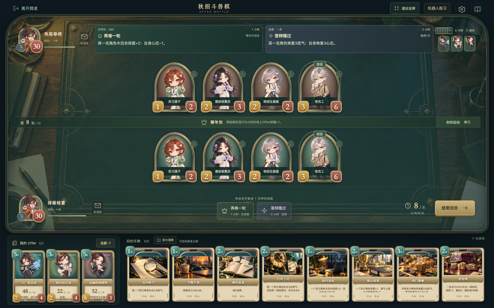
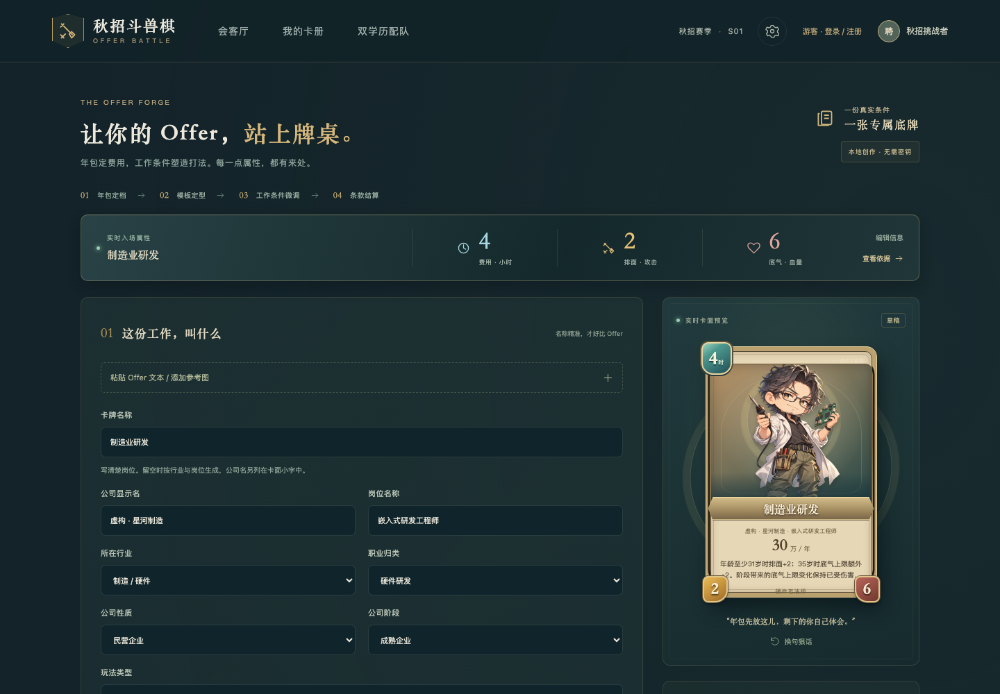
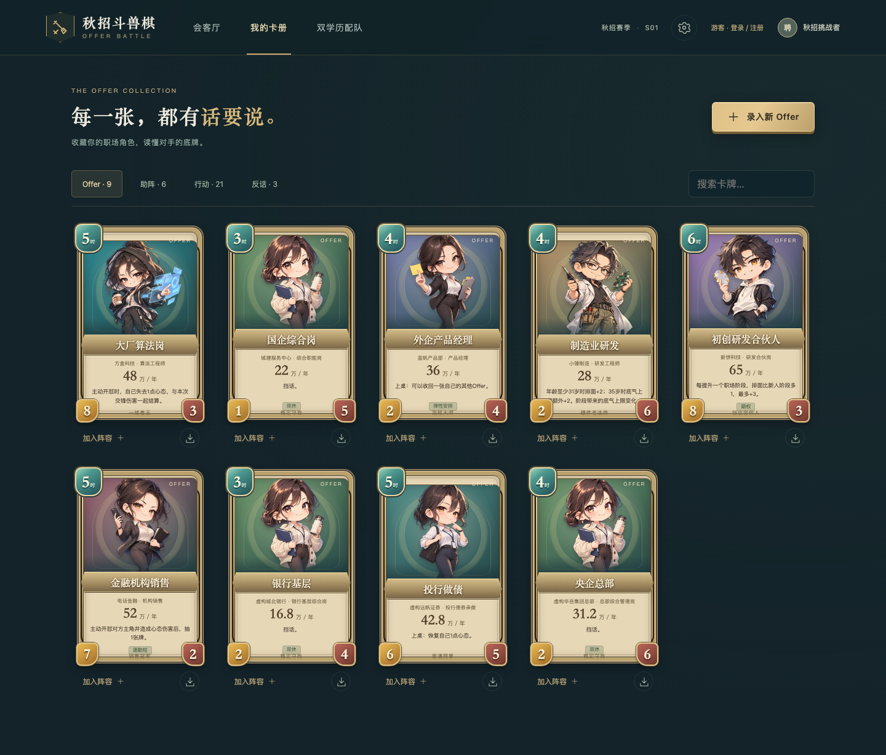
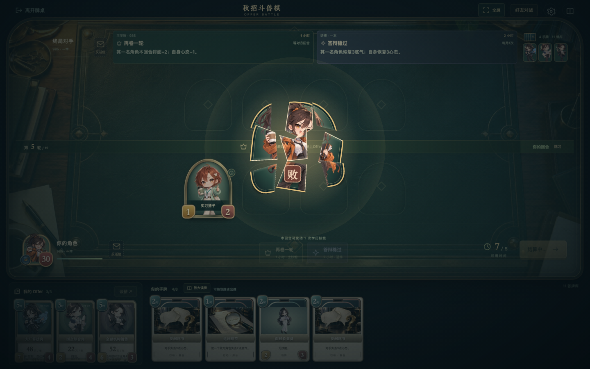

# 秋招斗兽棋 · Offer Battle

**工资先亮，底牌后出。**

把同学群里的 Offer 嘴仗，打成一场有来有回的卡牌对决。

大厂算法岗排面很足，银行基层底气很稳，制造业研发还能继续成长。可桌上只有四个位置，一轮只有几个小时——这张 Offer 现在上，还是留一手等朋友先出牌？

[游戏入口](https://weikezhang.cn/offer-battle/) · [五分钟上手](#第一局怎么开始) · [本地运行](#把牌桌开在自己电脑上) · [部署说明](DEPLOYMENT.md) · [设计手记](NOTES.md)


> 本仓库包含完整游戏代码、规则、服务端、内置资源、生成记录和测试。网页入口的上线状态、后端地址及线上验收记录以 [DEPLOYMENT.md](DEPLOYMENT.md) 为准；GitHub Pages 托管前端，游客人机与教程在本地运行，账号、好友联机与长期对局保存由 Cloudflare 后端提供。

## 这张牌桌有什么不一样

**你拿出来的是一份具体的工作。** 卡名显示“大厂算法岗”“投行做债”“央企总部”，公司、岗位和年包有各自的位置。11 种玩法类型负责技能，精确岗位名负责表达你的 Offer。以后加一个没见过的新职业，也不必重做整套规则。

**工资决定起点，工作条件决定打法。** 年包决定基础费用，工作性质与节奏调整上桌时机；城市、行业和公司情况决定排面与底气的有限转换。谈薪、挡话、隐藏反话、年龄成长、优化通知和转管理，再把这些差异变成出牌时的取舍。游戏里的职业强弱只描述卡牌机制，不给现实工作或学校排高低。

**双学历有配合，也有节制。** 10 个主技能 × 11 种进修，合计 110 个有序组合。主技能管节奏，进修从第 4 轮解锁、每局一次，两项共用每个己方回合的一次学历行动。对手两项技能的效果、费用和状态始终可见。

**一局从第一张牌到最后一击。** 五课实战教程、三种机器人、好友房、拖拽出牌、全屏牌桌、战报回放都已接入。攻击有接触和反击，技能有投射和爆发，退场会留出空位再补牌；败方碎裂退场后，胜负面板才登场。



## 第一局怎么开始

1. **先玩会，再配队。** 首页进入“跟着前辈，打会第一局”，完成上桌与攻击、挡话与目标、精确岗位与谈薪、双学历技能、35 岁优化与转管理五课。每课可重练，也能直接“先玩一局”挑战机器人。
2. **选你的底牌。** 配好第一学历、第二学历、3 张 Offer、12 张基础牌和 3 张应对牌。内置 9 张虚构公共 Offer，可以直接开打。
3. **用好这一轮的时间。** 每方初始 30 心态，每轮可用时间从 1 小时增长到最多 8 小时，场上各有 4 个角色位置，最多 12 轮。
4. **把牌放到桌上。** 支持鼠标和触摸拖拽，也保留点击操作。有目标的牌可以直接拖向合法角色，或先落桌再选目标。随时使用“放大读牌”。
5. **把这一局留下来。** 游客结算后可以查看当前回放、保存 PNG 名场面，或用原阵容再来一局。网页版注册后可以导出完整 JSON 战报，并将普通完整对局长期保存到账号。

开局会请求浏览器全屏；浏览器不允许时仍可继续游戏。桌面采用单屏牌桌，手机建议横屏；窄屏保留滚动与放大读牌。音乐、音效分别调节，动画可以切换为“减少动态效果”。


## 带上自己的 Offer



录入公司、准确岗位、薪酬组成、城市、行业、公司性质与阶段、工作性质和工作节奏，再选择至多一项已确认条款。未知岗位可以先自动匹配，也能手动确认一种现有玩法类型。

**Offer 编译器 2.1** 把年包先映射为 2–7 小时的基础费用，再计入工作条件：实习 −1，高强度或驻场轮班出差 +1，弹性工时 −1，最终仍在 2–7 小时内。模板按最终费用生成基础身材；城市、行业、公司性质和阶段、工作性质、节奏的倾向合计，最多在排面与底气之间转换 2 点，两项最低为 1，随后再支付条款代价。

因此，同样年包也能做成偏进攻或偏稳健的卡，低费也有降低基础身材的代价。城市成本可自动匹配或手动确认；这套映射是固定游戏规则，不是现实成本指数或职业排名。

游客与好友房使用同一套确定性公式，联机时由服务器重新编译并校验。外观不决定属性，新局会把旧收藏更新到当前编译版本；已开始的牌局和旧战报保留原定义。战斗规则版本仍为 2.0.0，与 Offer 编译版本分别维护。

| 你想改什么 | 怎么实现 |
| --- | --- |
| 新公司、新岗位、新薪酬 | 在游戏里录入并确认，无需修改代码 |
| 同年包、不同城市或工作条件 | 确认成本档位、公司与工作字段，按统一公式计算费用和属性倾向 |
| “银行基层”使用更稳的打法 | 生成前确认已有玩法类型，使用统一数值表 |
| 新卡名、台词或角色外观 | 修改创作层，不修改战斗规则 |
| 全新的机制或技能 | 扩展规则目录、引擎和测试，并升级规则版本 |

详见 [Offer 规则与扩展](RULES_AND_EXTENSION.md)。内置薪酬是演示数据；计价年包是游戏公式，不是薪酬市场报价或求职建议。



## 和朋友约一场

首页“和朋友约一场”创建房间，把邀请链接或房间码发给朋友。两人准备后选择应对牌、换起手牌，进入同一张牌桌。网页版需要先注册或登录账号。结束后可在原房间重赛；刷新或短暂断线时可恢复自己的座位。游客仍可直接体验本地机器人和五课教程。

服务端负责裁定合法动作、检查版本和命令幂等性，只向各自玩家发送可见信息。房间码用于加入，不能代替会话令牌接管座位。机器人也只读取同样裁剪后的玩家视图。

线上账号使用用户名和密码，注册时提供恢复码，不要求邮箱。请妥善保存恢复码；账号用于好友联机和长期保存对局，游客资料留在当前浏览器。Cloudflare 后端承担身份、房间与持久化，Pages 本身只托管静态页面。自行部署时请按 [部署文档](DEPLOYMENT.md) 完成配置和双客户端验收；免费额度存在限制，不承诺无限流量或永久无中断运行。

## 看得到的演出，找得到的来源

深青、黄铜和胡桃木构成这间秋招会客厅。成年职场角色、卡牌插画和背景采用 AI 辅助生成；卡框、中文、数字、规则信息和动态目标由程序绘制。图片不会藏着决定输赢的属性。

- **画面：** 56 次独立插画生成，职业母版可复用于任意新 Offer；保留原图、提示词、资源映射与校验信息。
- **动画：** 真实目标攻击、粒子与命中反馈、技能影片、反话翻牌、退场占位和双方战败演出；首次加载与重连不重复播放旧事件。
- **声音：** 六首 AI 辅助制作的情境配乐，覆盖大厅、教学、对战、紧张、胜利和失败；16 种程序合成音效，支持音乐交叉淡入淡出和强效果时短暂降低配乐。
- **离线资源：** 内置资源随仓库提供，正常游玩不需要生成模型密钥。可选文案/图像服务仅用于新的创作任务，未配置或失败时仍能开打。



制作过程见 [美术与声音报告](ASSET_REPORT.md)，使用范围见 [素材许可与来源](ASSET_LICENSE.md)。这是独立项目，与 Blizzard、《炉石传说》、出现的学校及其他机构没有官方关联；未使用《炉石传说》的原画、录音或品牌素材。

## 把牌桌开在自己电脑上

需要 **Node.js 24 或更新版本**。首次安装依赖需要联网；内置图片、音频和规则不依赖游玩时调用生成服务。

```sh
git clone https://github.com/shoal-rat/offer-battle.git
cd offer-battle
npm ci
npm run build
npm start
```

打开 `http://localhost:5173`。默认监听 `0.0.0.0:5173`，同一局域网的朋友可使用你的局域网 IP。更换端口、数据目录、部署路径及可选服务配置见 [本地使用说明](docs/LOCAL_PLAY.md) 和 [部署说明](DEPLOYMENT.md)。

也可使用 `./start.sh`，macOS 双击 `开始游戏.command`，Windows PowerShell 运行 `./start.ps1`。启动器默认构建并运行稳定生产版。开发代码时使用 `npm run dev`，开发服务会热刷新，不建议拿正在修改源码的页面进行正式对局。

## 源码里有什么

```text
src/game/            确定性规则、Offer 编译器、合法动作、机器人、教程
src/local-backend.ts 静态游客对局、临时恢复与当前回放
src/pages/           录入、配队、战斗、回放与账号战绩界面
src/components/      拖拽、事件演出、对方技能与恢复界面
cloudflare/          Worker 账号服务、好友房与 SQLite Durable Objects
server/              保留的 Node 自托管对局、会话与持久化
public/assets/       运行时插画、UI、音乐、音效和技能影片
assets/              生成原件、创作要求、来源与制作记录
scripts/             资源检查、内容种子、模拟、音频制作等工具
spec/                保留的 2.0 原始玩法与工程规格
tests/               规则、服务端、浏览器与视觉回归测试
evidence/            精选验收记录、资源校验与对局模拟证据
docs/                本地使用、预览图与补充文档
```

实际运行产生的 `data/`、访客令牌、收藏、房间状态及 `.env` 不应提交。React + TypeScript + Vite 构建界面，Node + WebSocket 驱动房间，默认以原子文件存储持久化；这条 Node 路径适合本地开发和独立自托管。公开网页版采用静态游客模式与 Cloudflare 联机后端，具体目录、环境变量和发布步骤见部署文档。

## 验证，而不是只看截图

```sh
npm run typecheck
npm test
npm run assets:check
npm run build
npm run simulate -- --games 220
npx playwright install chromium
E2E_PRODUCTION=1 npm run test:e2e
npm run test:e2e:static
npm run test:cloudflare
```

自动化检查覆盖 Offer 确定性编译、服务端裁定、197 项运行资源、本地与联机界面、静态游客、账号保存和 Cloudflare 运行时；220 局固定种子模拟另记录编译器与战斗版本。部分界面测试使用真实引擎局面与可控传输夹具，工程检查不等同于真人竞技平衡或公网压力测试。最新执行批次与结果见 [测试报告](TEST_REPORT.md)、[机器人对局观测](BALANCE_REPORT.md)；线上结果见 [部署文档](DEPLOYMENT.md)。

## 继续把它做得好玩

欢迎提交清楚的 Bug 复现、读牌与触控体验改进、能说明问题的对局战报，以及有代价、有反制的新机制。开始前可读 [参与贡献](CONTRIBUTING.md)、[设计手记](NOTES.md) 和 [更新日志](CHANGELOG.md)。安全问题请参考 [安全说明](SECURITY.md)。

代码与文档使用 [MIT License](LICENSE)。AI 辅助素材的来源及单独适用说明见 [ASSET_LICENSE.md](ASSET_LICENSE.md)，第三方依赖见 [THIRD_PARTY_NOTICES.md](THIRD_PARTY_NOTICES.md)。

<details>
<summary>English overview</summary>

**Offer Battle** is a Chinese-language, turn-based card game about comparing job offers. Bring a specific role, build a dual-education loadout, manage time and morale, and challenge a bot or a friend. The repository includes an authoritative Node/WebSocket server, deterministic rules and replay, five playable tutorials, versioned offer compilation using salary and work conditions, drag-and-drop interaction, animation, music, assets, and automated tests.

Requires Node.js 24+. Run `npm ci`, `npm run build`, and `npm start`. GitHub Pages hosts the frontend. Guests can play bots and tutorials locally; registered accounts use a Cloudflare backend for friend matches and persistent match history. See [DEPLOYMENT.md](DEPLOYMENT.md) for the actual deployment status. Code is MIT-licensed; generated media has separate provenance and licensing notes in [ASSET_LICENSE.md](ASSET_LICENSE.md).

</details>
