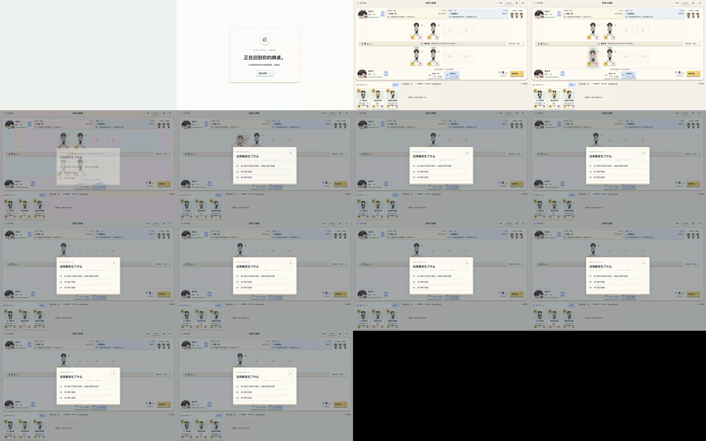

# Motion 2.2：实现、测量与未完成项

此报告来自 **2.2 开发分支的本地生产构建**，记录日期为 2026-09-27（Asia/Shanghai）。它不是上线确认，也不是 40 项动作均通过独立视觉验收的声明。代码提交 GitHub 后的独立代理复核与补丁记录另由总验收维护。汇总见 [summary.json](motion/summary.json)。

## 当前实现

[MotionDirector](../src/motion/MotionDirector.ts) 使用反馈、环境、导航、战斗、重点提示五通道；导航与重点提示取最新请求，环境同时最多两项，战斗正式组依序执行。任务拥有定时器、WAAPI 动画和清理函数，重复事件按作用域与 ID 去重。展示积压达到 1,200 ms 后压缩，超过 2,000 ms 对齐当前状态。

[事件适配器](../src/motion/eventAdapter.ts) 只消费公开的正式事件。网络忙态、合法指令和展示动作分开；查看卡牌、日志及复盘不等待演出。提交动作前，仅在关联目标尚处于位移时追上当前局面，再检查版本与目标。攻击为 460 ms、接触节点为 220 ms，退场保留场位 320 ms，随后补位 220 ms。飞扑装饰不带属性文字，场上数值保持水平可读。

终局确认后取消普通积压，最多使用 190 ms 最后一击与 650 ms 收尾，然后显示结果。完成、取消、隐藏、异常与已结束快照都有释放路径，不再让一个通用“动画忙”标记控制结果页。实际用户等待还受主线程调度影响，因此报告同时记录正常速度观测值，不把定时器数字当作实测。

减少动态时不使用飞扑、粒子与翻转；明确选择完整动态可覆盖系统偏好。隐藏页停止画面与声音并推进事件游标，恢复只看当前局面。拖拽的跟手任务持续到手势完成，取消回弹同样由 director 清理。页面装饰过渡不阻塞路由，不复制文字和交互控件。

## 执行过的验证

| 编号 | 实际检查 | 结果 |
| --- | --- | --- |
| U | 动效调度、战斗分组、占位、音乐音效、分享隐私和高光共 43 项单测 | 43 通过，0 失败、0 跳过；类型检查通过 |
| B1 | 真实规则预设局面执行攻击，双方同时退场；播放中打开日志，检查原场位和数值 | 通过 |
| B2 | 12 组快速公共快照积压后终局；结果出现、不与战败层重叠、重复快照不重播 | 通过；测得 866.7 ms |
| B3 | 减少动态、显式完整动态覆盖系统设置、10 次换局、隐藏期间真实攻击事件 | 通过；返回后无旧动画、无残留战斗计时器或装饰 |
| B4 | 真实时间连续 30 秒对局，39 条合法规则指令、逐帧采样 | 通过当前桌面实验室阈值 |
| B5 | 390×844 对方技能字级与边界、结果复盘跳到包含实际事件的回放帧 | 通过 |

5 项浏览器专项共 48.0 秒，0 失败、0 跳过、0 重试。源码为 [motion-v22.spec.ts](../tests/e2e/motion-v22.spec.ts)。测试用预设规则局面与可控 HTTP/WSS 传输；实际攻击通过 `applyCommand`，积压测试另外注入已确认的公共组。它验证客户端展示边界，不验证公网传输。后台测试触发可控 visibility 事件，不冒充操作系统真实限速。

### 后续修复回归：SVG 蒙版作用域

原实现删除了复制图层的 SVG ID，会使分层蒙版引用失效。修复改为重命名 ID 并同步 `url(#id)` / `href` 引用，保留副本自己的 defs。针对重建后的生产包另执行 1 项浏览器回归，通过；66 份实际帧样本包含 28 份飞行和 38 份退场残影，身体、脸和道具均有本地唯一蒙版，不与场上实例 ID 冲突。见 [clone-masks.json](motion/clone-masks.json)。此检查单独计数，不合并成此前 5 项同批全量结果。

### 后续实现补齐：实测分档与环境动作设置

接线审查发现此前只存在 `setMotionQuality`，没有实测降档调用；本轮补入 `budgetGovernor.ts`。它只在页面可见、非减少动态且仍为 full 时采样，导航演出后预热 750 ms；超过 250 ms 的挂起间隔会丢弃当前窗口。每个窗口至少 4 秒、120 帧，连续两个窗口 P95 大于 25 ms 或超过 50 ms 的帧占比大于 1% 时降为 compact，单次运行不来回升降。隐藏、减少动态和销毁会取消 RAF 所有权，恢复后重新预热。

compact 复用正式演出中的少粒子（9 降为 3）和省略技能影片路径，另移除飞行与残影的装饰滤镜；数值、文字、退场占位、规则和输入不变。降档只在本机 sessionStorage 记录帧数、窗口时长、P95 和长帧比例，不记录身份、牌或自由文本，不上传。设置新增“首页环境动作”开关，与首页原有暂停入口共享同一偏好。

新增 5 项 governor 单测与原 9 项 director 单测共 **14 / 14 通过**，类型检查通过；覆盖持续超预算、孤立慢窗、长帧比例、导航与挂起重置、隐藏取消和销毁。此前浏览器帧数据是补齐 governor **之前**的样本，未据新单测改写为“自动降档后性能已通过”；新构建的真实设备表现仍需复核。

## 正常样本和压力失败样本分开保留

| 样本 | 时长 / 帧数 | P95 帧间隔 | 超过 50 ms 比例 | 结论 |
| --- | --- | --- | --- | --- |
| 连续真实规则指令 | 30,365.5 ms / 1,800 帧 | 16.8 ms | 0 | 达到本次 P95 ≤25 ms、长帧 ≤1% 的目标 |
| 约每秒销毁并重建完整牌桌 | 30,865.4 ms / 1,749 帧 | 33.3 ms | 0 | **未达到 P95 目标，保留待复核** |

正常局原始数据见 [frame-budget.json](motion/frame-budget.json)，失败压力样本见 [frame-budget-remount-stress.json](motion/frame-budget-remount-stress.json)。环境为 macOS、Headless Chromium 153、1440×900、DPR 1、报告 10 个逻辑处理器，估计刷新率约 59.88 Hz。没有加速时间，也没有把重建压力场景改名为普通对局后删除失败数据。两种负载回答不同的问题，不能据此声称移动实机或所有页面切换都已流畅。

终局采样从第一帧看到 `finished` 到第一次结果可见为 866.7 ms，没有战败层与结果重叠，见 [result-deadline.json](motion/result-deadline.json)。自动断言允许最多 925 ms，包含 900 ms 预算与帧采样容差。此处测量是浏览器接收后的展示，不包含服务器与网络时延。

## 原速画面

- [连续 30 秒对局录像](motion/continuous-gameplay-30s.webm)：保持真实时间，包含实际规则指令。
- [接触、双退场与演出中读取日志](motion/contact-and-readable-ui.webm)：日志遮住部分画面，证明可读操作可继续，不能用于独立判断所有退场细节。
- [积压后终局录像](motion/result-with-backlog.webm)：查看收尾与结果的先后关系。
- [390px 回放定位截图](motion/mobile-replay.png)。

下方接触片由原视频按每秒 6 帧顺序采样，共 16 帧；从左到右、从上到下，约对应片头 0–2.5 秒。视频片头包含页面恢复，随后打开日志；截图不能替代时间数据。



## 历史线上结果卡住的取证

针对此前 2.1 正式网页出现过的一次“服务端结束但结果面板未出现”，本次使用已有两个隔离账号复跑，未新建公网账号。造卡、真实双方入房、应对牌和换牌、UI 出牌、第二端刷新重连通过，之后 63 条合法 API 指令推进到第 12 轮、版本 74。两端分别收到 183 和 178 次 WSS 快照，最终 WebSocket、React 状态和结果层均一致：`finished`、版本 74、网络非忙。

**原故障本次未复现，不能宣称已经找到或修复其传输根因。** 2.2 对展示收尾增加独立上限与生命周期回归，减少动画阻塞结果的可能；新版本仍需正式 HTTPS/WSS 复核。取证的登录资料、完整流量与原始本机路径不公开，仅保留上述脱敏观察。

## 40 项动作接线清单

“已绑定”表示存在运行入口，**不代表独立视觉验收通过**。B1–B5 对应上面的浏览器专项；U 覆盖通用调度契约。动作元数据以 [cues.ts](../src/motion/cues.ts) 为准，分组可能调整实际时长和并行策略。

| 动作 | 通道 | 运行入口 | 当前证据 / 待办 |
| --- | --- | --- | --- |
| M01 homeAssemble | navigation | [HomeStage.tsx](../src/scene/HomeStage.tsx) | 已绑定；尚无该项独立视觉验收记录 |
| M02 titleSettle | ambient | [HomeStage.tsx](../src/scene/HomeStage.tsx) | 已绑定；尚无该项独立视觉验收记录 |
| M03 propUnfold | ambient | [HomeStage.tsx](../src/scene/HomeStage.tsx) | 已绑定；尚无该项独立视觉验收记录 |
| M04 blink | ambient | [HomeStage.tsx](../src/scene/HomeStage.tsx) | 已绑定；尚无该项独立视觉验收记录 |
| M05 idleSway | ambient | [HomeStage.tsx](../src/scene/HomeStage.tsx) | 已绑定；尚无该项独立视觉验收记录 |
| M06 quip | attention | [HomeStage.tsx](../src/scene/HomeStage.tsx) | 已绑定；尚无该项独立视觉验收记录 |
| M07 press | feedback | [useInterfaceMotion.ts](../src/motion/useInterfaceMotion.ts) | 已绑定；尚无该项独立视觉验收记录 |
| M08 hoverFocus | feedback | [useInterfaceMotion.ts](../src/motion/useInterfaceMotion.ts) | 已绑定；尚无该项独立视觉验收记录 |
| M09 hotspotReact | feedback | [HomeStage.tsx](../src/scene/HomeStage.tsx) | 已绑定；尚无该项独立视觉验收记录 |
| M10 panelOpen | navigation | [ui.tsx](../src/ui.tsx) | B1 中查看日志可用；单项开合观感待独立复核 |
| M11 panelClose | navigation | [ui.tsx](../src/ui.tsx) | 已绑定；单项观感待独立复核 |
| M12 collectionTurn | navigation | [useSceneBridge.ts](../src/motion/useSceneBridge.ts) | 已绑定；尚无该项独立视觉验收记录 |
| M13 cardFocus | feedback | [useInterfaceMotion.ts](../src/motion/useInterfaceMotion.ts) | 已绑定；尚无该项独立视觉验收记录 |
| M14 dragFollow | feedback | [useCardDrag.tsx](../src/components/useCardDrag.tsx) | 已绑定；尚无该项独立视觉验收记录 |
| M15 snapReturn | feedback | [useCardDrag.tsx](../src/components/useCardDrag.tsx) | 已绑定；尚无该项独立视觉验收记录 |
| M16 deckInsert | navigation | [Loadout.tsx](../src/pages/Loadout.tsx) | 已绑定；尚无该项独立视觉验收记录 |
| M17 creatorUnfold | navigation | [useSceneBridge.ts](../src/motion/useSceneBridge.ts) | 已绑定；尚无该项独立视觉验收记录 |
| M18 generationReady | attention | [CreateOffer.tsx](../src/pages/CreateOffer.tsx) | 已绑定；尚无该项独立视觉验收记录 |
| M19 invitationSent | feedback | [App.tsx](../src/App.tsx) | 已绑定；尚无该项独立视觉验收记录 |
| M20 friendSeated | navigation | [App.tsx](../src/App.tsx) | 已绑定；尚无该项独立视觉验收记录 |
| M21 matchBridge | navigation | [useSceneBridge.ts](../src/motion/useSceneBridge.ts) | 已绑定；尚无该项独立视觉验收记录 |
| M22 dealCard | battle | [BattleEffects.tsx](../src/components/BattleEffects.tsx) | 已绑定；尚无该项独立视觉验收记录 |
| M23 deploy | battle | [BattleEffects.tsx](../src/components/BattleEffects.tsx) | 已绑定；尚无该项独立视觉验收记录 |
| M24 attack | battle | [BattleEffects.tsx](../src/components/BattleEffects.tsx) | B1 / B3 / B4：实际攻击、隐藏与连续局录像 |
| M25 hit | battle | [BattleEffects.tsx](../src/components/BattleEffects.tsx) | B1：接触节点与双退场；声音单测 |
| M26 buff | battle | [BattleEffects.tsx](../src/components/BattleEffects.tsx) | 已绑定；尚无该项独立视觉验收记录 |
| M27 heal | battle | [BattleEffects.tsx](../src/components/BattleEffects.tsx) | 已绑定；尚无该项独立视觉验收记录 |
| M28 retortCancel | battle | [BattleEffects.tsx](../src/components/BattleEffects.tsx) | 已绑定；尚无该项独立视觉验收记录 |
| M29 ageAdvance | battle | [BattleEffects.tsx](../src/components/BattleEffects.tsx) | 已绑定；尚无该项独立视觉验收记录 |
| M30 notice | battle | [BattleEffects.tsx](../src/components/BattleEffects.tsx) | 已绑定；尚无该项独立视觉验收记录 |
| M31 management | battle | [BattleEffects.tsx](../src/components/BattleEffects.tsx) | 已绑定；尚无该项独立视觉验收记录 |
| M32 returnToHand | battle | [BattleEffects.tsx](../src/components/BattleEffects.tsx) | 已绑定；尚无该项独立视觉验收记录 |
| M33 retire | battle | [BattleEffects.tsx](../src/components/BattleEffects.tsx) | B1：双退场和原场位保留 |
| M34 boardReflow | battle | [useBoardReflow.ts](../src/motion/useBoardReflow.ts) | B1：退场后清除占位并补位 |
| M35 turnBanner | attention | [BattleEffects.tsx](../src/components/BattleEffects.tsx) | 已绑定；尚无该项独立视觉验收记录 |
| M36 resultCurtain | attention | [BattleEffects.tsx](../src/components/BattleEffects.tsx) | B2 / B3：积压、重复快照、减少动态及 866.7 ms 收尾 |
| M37 recapCard | navigation | [BattleRecap.tsx](../src/components/BattleRecap.tsx) | B5：移动端复盘与真实事件跳转 |
| M38 saveReceipt | feedback | [App.tsx](../src/App.tsx) | 已绑定；尚无该项独立视觉验收记录 |
| M39 errorNote | attention | [CreateOffer.tsx](../src/pages/CreateOffer.tsx) | 已绑定；尚无该项独立视觉验收记录 |
| M40 topicChange | battle | [BattleEffects.tsx](../src/components/BattleEffects.tsx) | 已绑定；尚无该项独立视觉验收记录 |

## 未完成或尚未证明

- 尚无逐项 40 段独立视觉证据，也未执行计划中的 48 次独立代理运行。交付前应对照实际提交补充，没有执行的行保持未验收。
- 频繁重建完整牌桌的压力样本超过帧间隔预算；移动实机、低性能设备、浏览器原生后台节流和长时间运行仍需独立检查。
- 纸片人物以互补遮罩分离身体、脸与道具，未重建被遮挡区域；算法和研发有四种脸部变体，其余人物保留中性表情，不能等同于完整独立绘制的动画骨骼。
- 事件台词采用每回合最多两条预算与关闭设置；目前绑定上桌、回手及可匹配人物的反话事件，不能声称六类人物台词在所有情况下完整演出。
- 高光依据公开事件和实际状态变化，回放跳到包含事件的指令帧；同一条规则指令内部没有伪造中间状态。它不提供穷举最优行动证明。

可复跑核心专项：

```sh
npx tsx --test tests/motion-director.test.ts tests/battle-motion.test.ts tests/board-presentation.test.ts tests/audio.test.ts tests/sound-effects.test.ts tests/share-privacy.test.ts tests/highlights.test.ts
npm run typecheck
npm run build
E2E_PRODUCTION=1 npx playwright test tests/e2e/motion-v22.spec.ts
```

浏览器录像和所有 trace 可在本地启用 Playwright `video: 'on'`、`trace: 'on'` 重建。公开报告只保留上述精选画面与脱敏指标，不上传包含请求资料的原始 trace。
