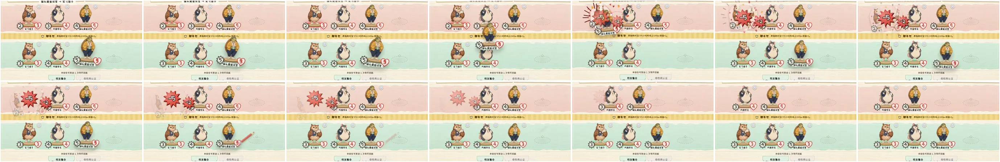
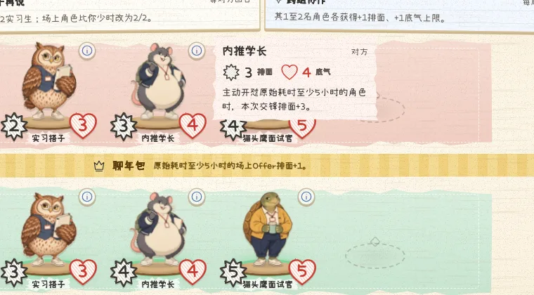
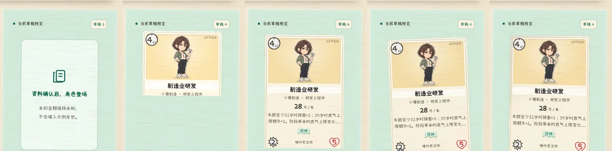

# 纸艺 2.3：手工纸牌桌、有分量的每一击、会算残局的对手

这份报告记录 2.3.0-beta.1 的外观、动画、交互与人机改动，以及对应的实测证据。战斗规则仍为 2.0.0，Offer 编译器仍为 2.1.0，只有机器人策略升级到 2.3.0。截图和逐帧图来自本地生产构建和开发服务器的真实对局，不是效果图。

## 起点：旧动画到底哪里不对

改动之前，我用 Playwright 录下一段真实对局（中局、双方各三名角色、玩家攻击、打出助阵、结束回合看机器人行动），逐帧检查后发现八个问题：

1. **数值剧透。** 新状态一到，场上的数字立刻变化。攻击者还在半路，它的底气已经从 5 变成 3。
2. **没有打击感。** 攻击是 1,180 ms 的匀速直线平移，没有抬起、蓄力、命中停顿、震屏和回弹。
3. **积压就闪过或跳过。** 队列超过 3 秒就把所有动画压缩成 120 ms，超过 5 秒直接跳过。机器人连续攻击三次就会触发。
4. **对手的最后一击被截断。** 轮到自己时会取消所有进行中的动画，“轮到你了”经常盖住对手最后一次攻击。
5. **音效不同步。** 音效有自己独立的队列，和画面队列各走各的。
6. **退场、上桌、对手出牌几乎没有表现。** 对手打出的行动牌，玩家看不到是哪一张。
7. **结算太仓促。** 为了满足 900 ms 的旧预算，原本 2.4 秒的结算演出被加速到 650 ms，是原速的 3.7 倍。
8. **牌桌跳动。** “边打边学”提示条出现和消失时，整张牌桌会上下移动约 110 px。

## 动画：谁负责什么

| 模块 | 职责 |
| --- | --- |
| [battle-motion.ts](../src/components/battle-motion.ts) | 每一拍的时间（第二轮按炉石节奏放慢后）：攻击抬起 220 ms、接触 520 ms、命中停顿 110 ms、全长 1,100 ms；上桌 820 ms；对手出牌展示 1,800 ms；数值至少停留 1,500 ms；铅笔改写 950 ms；退场前立牌抖动 260 ms。分组时如果组内还有要改写的数字，组时长会延长到改写结束。 |
| [stat-holds.ts](../src/components/stat-holds.ts) | “数值账本”。每批新状态到达、浏览器绘制之前，就把本批会变化的数字按“还没揭示的变化量”冻结在旧值，每一击落下时才揭示对应的那部分。冻结值只写在 React 不管理的 `data-hold` 属性里，重新渲染不会冲掉它。追帧、隐藏页面和卸载时一次性释放。 |
| [battle-fx.ts](../src/components/battle-fx.ts) | 纸艺特效图元：剪纸爆裂数字、纸屑、纸环、速度线、按伤害大小的桌面震动、受击后仰闪白、撕纸退场、橡皮章、奖章花结、回合横幅、铅笔改写。 |
| [BattleEffects.tsx](../src/components/BattleEffects.tsx) | 编排：把公开事件分组交给 MotionDirector，按拍调度上面的图元，并在每组动画真正开始时派发这一组的音效。 |
| [MotionDirector.ts](../src/motion/MotionDirector.ts) | 队列上限改为：积压超过 7 秒时，尚未开始的动画提速到 65%（最短 320 ms），超过 12 秒才对齐当前牌桌。 |

几个关键的行为：

- **攻击的五拍。** 立牌抬起并放大，向后仰蓄力，加速冲向目标（在目标前 46 px 停住，看得出是撞上去的），命中停顿 110 ms，然后回弹。命中瞬间目标出现剪纸爆裂数字；攻击者受到的反伤显示在它自己那一侧，不和目标的数字叠在一起。
- **数字等到命中才变。** 目标的数字在接触时用铅笔改写；攻击者自己的数字等它回到原位、立定之后再改写。一个角色阵亡时，数字直接归零，随后立牌沿锯齿线撕成两半落下，同一行的其他角色在撕纸结束后才补位。
- **对手出牌先亮牌。** 对手打出的牌从它的手牌位置飞到牌桌左侧翻开，停留足够读完卡面的时间，再飞向目标结算。
- **回合横幅排在最后。** “轮到你了”进入同一个战斗队列，排在对手最后一击之后播放；本回合开始时的抽牌动画排在横幅之后。
- **输入锁只针对对手的演出。** 你自己的攻击还在播放时，可以继续选下一张牌或下一次攻击，只有涉及正在动的角色时才会快进。对手的演出和回合横幅播完之前，操作保持等待，就像坐在同一张牌桌前。
- **本地人机等画面播完再出手。** 游客练习（静态站点）的机器人会在动画播放期间就开始思考，把决策暂存，等画面安静 700 ms、且距上一步超过 1,280 ms 后再落子。好友对局和服务器不读取这个信号，回合计时不受影响。

## 铅笔改写

数值变化时，一支铅笔从纸外斜着伸进来，先用橡皮那头在旧数字上来回擦（旧数字晕开、留下一块擦痕），抬起翻转，再用笔尖从左到右写出新数字，然后离开。生命和心态用红铅笔，排面和其他数值用黑铅笔。同一时刻最多出现四支铅笔，更多的数字（例如全场群伤）和即将撕碎的立牌只做简单的数字弹跳，避免牌桌被铅笔淹没。动画被跳过或取消时，被隐藏的数字会立刻恢复显示。

## 纸艺美术

- **材料全部程序化生成。** [generate-paper-tokens.mjs](../scripts/generate-paper-tokens.mjs) 用固定种子生成纸张纤维、牛皮纸板、带纸板厚度的撕边边框（用 `border-image` 实现，不裁切内容，不影响焦点框和滚动）、若干组撕边与剪刀剪裁轮廓、铅笔涂鸦徽章，输出到 [paper-tokens.css](../src/styles/paper-tokens.css)。没有引入新的位图素材。
- **牌桌。** 牛皮纸板桌面上铺一张撕边桌布，两个角贴胶带；敌我战线是粉色和薄荷色撕纸条；空位是铅笔画的站位圈；中间一条胶带写着轮数、话题和回合归属。
- **立牌。** 角色站在木质底座上，可攻击时轻跳、底座发绿光；可被选为目标时脚下出现旋转的红色虚线靶圈；挡话角色背后立着一面纸板盾牌。
- **全局。** 按钮是剪刀剪出的卡纸，底下露出纸板边；弹窗是撕边纸张加一条胶带；卡牌带虚线缝线和按类型区分的色带。
- **手写体。** 全部文字使用开源的「小赖字体 Xiaolai SC」（SIL OFL 1.1），按字符区段切片，浏览器只下载页面实际用到的字。数值写在铅笔涂鸦上：红铅笔爱心、石墨星芒、铅笔画的钟。
- 拖出的幽灵卡、对手出牌展示卡和特效层克隆体都在 `.app` 之外渲染，样式作用域专门覆盖了这些浮层，所以它们和桌上的卡长得一样。

## 给普通玩家的交互

- 鼠标在场上角色上停 0.3 秒，旁边出现规则便签：名字、身材、状态、规则原文。
- 选中攻击者后，一条纸条箭头从它指向光标；落在合法目标上时显示靶圈。右键取消瞄准。
- 桌面端的目标提示移到牌桌上方，不再遮挡手牌。
- 只剩“结束回合”可做时，按钮变绿并轻轻晃动；限时对局最后 15 秒，按钮下出现一根燃烧的纸引线。
- 满手时卡牌自动叠放：每张保持原宽，空间不够时互相叠压，最新一张完整显示，不会伸出屏幕。
- 修复：悬停放大后再拖动，拖出的幽灵卡曾经跟着放大。现在按布局尺寸取值，不受悬停变换影响。

## 人机：随机对手与更会算的“终面Boss”

**随机对手。** [botOpponents.ts](../src/game/botOpponents.ts) 每局从公开模板里组合对手：9 套基础牌（3 套预设家族加 6 套新手卡组）、9 份示例 Offer、10 × 11 种学历组合、6 张应对牌，按性格加权随机（约三分之二拿到符合性格的基础牌），再随机取名。房间种子相同则对手相同，回放可复现。教程课程仍用固定导师阵容。测试覆盖 360 个随机对手的合法性、60 局内的多样性和性格倾向。

**残局推演。** 大多数对局会打满 12 轮，按心态比较结算，而静态评估只能近似这个终点。2.3 的最高难度从第 9 轮起，把每个入围的回合计划（最多 8 个）放进每个采样的隐藏信息世界，用快速规则策略替双方把整局打完，按真实胜负参与排序；越接近终局，推演结果的权重越大。

**怎么验证的。** 冻结 2.2.0 的搜索与评估作为参照（[reference/](../src/game/ai/reference/)），用 [benchmark-expert.ts](../scripts/benchmark-expert.ts) 做镜像对战：每对使用同一套随机模板阵容，双方交换座位各打一局，固定节点预算，关闭时间保护以便复现。

| 版本 | 局数 | 得分率 | 成对自助法 95% 区间 | 结论 |
| --- | --- | --- | --- | --- |
| 残局推演（已上线） | 108 | 0.542 | [0.509, 0.579] | 显著优于 2.2.0，但幅度不大 |
| 只加入“交换局势”评估（未上线） | 108 | 0.495 | [0.435, 0.556] | 与 2.2.0 无差别，已撤回 |

逐局记录见 [ai-2.3-expert-vs-2.2.json](ai-2.3-expert-vs-2.2.json)。另外两个变体（对手完整回合推演加 6 个采样世界；推演提前到第 7 轮）分别只跑了 19 局和 6 局就停了，因为慢了数倍，这里不据此下任何结论。机器人之间的对战胜率不等于对真人的强度。

浏览器里最高难度每步最多思考 1.8 秒，但思考在对手动画播放期间就开始，所以大部分时间藏在演出里。

## 第二轮：试玩之后

第一轮做完后实际上手玩了一局，反馈集中在四点：数字和动画还是出现、消失得太快；音画仍有错位；出牌必须拖到指定区域太死板；卡牌不会像炉石那样随鼠标倾斜。另外要求时代更替要有鲜明的提示（参考文明 6），单击不再出牌、改为拿近细看。

- **节奏。** 上表的时间常数整体放慢到接近炉石的读秒：对手出牌展示 1.8 s，任何数值变化至少停留 1.5 s，攻击 1.1 s，铅笔改写 0.95 s，结算 2 s。积压提速阈值同步放宽到 7 s / 12 s，避免放慢后更容易触发压缩。
- **音画同步。** 旧版每次播放都新建 `Audio` 元素，首帧延迟不稳定。现在第一次点击时把全部音效预解码进 Web Audio，按画面时间逐样本排程（撕纸声对齐抖动结束后的撕开瞬间）；解码失败时回退到 `Audio`。
- **拖出手牌区就出牌。** 指针离开手牌托盘、仍在牌桌范围内松手即算出牌；只有需要目标的牌才要落在目标上，落在空桌面时打开目标选择。单击改为“拿近细看”：卡牌从原位放大到屏幕中央，旁边写着能不能出、怎么出，点空白处、按 Esc 或「放回」回到手里。
- **纸的反光。** 倾斜时的光照是哑光纸：朝向光源一侧宽而柔地提亮、背光侧略暗，阴影朝反方向滑开，不做塑料卡的镜面高光条。

- **时代更替。** 第 4、7 轮开始时，牌桌暗下、背后放射光，时代扉页立起，写着幕名、这一时代的公共话题效果和里程碑（第二学历从第 4 轮可发动；终局在第 12 轮）；底部三枚时代印章，当前一枚重重盖下、撒出纸花。仪式进入战斗队列，排在上一轮最后一击之后、「轮到你了」之前。之后牌桌胶带、话题条和贴纸换成新时代的颜色，话题条旁 12 格进度标出当前轮次。顶部话题条会等到印章落下才换成新时代，此前一直显示旧话题。

- **造卡与好友房。** 造卡资料确认后，卡牌像从小打印机里吐出来：从上往下出现，落下后一弹，停在歪斜的角度。好友房等待页原本还是圆角白卡，这次改成胶带固定的票根和纸卡立牌，空位放一把小纸椅，准备好后盖「已准备」印章。

完整对局自测（对“终面Boss”，全程只用真实界面：拖牌、点击攻击、结束回合）走到了第 8 轮结算，没有页面错误，第 4、7 轮的时代仪式和换色都正常。自测找出并修复了三个问题：

- **拖到一半牌自己回去了。** 渲染吃力时，动效预算调节器会把画质降为精简，而 `MotionDirector.setPreferences` 在画质变化时结束所有进行中的动效，其中包括“拖拽跟随”，拖拽就被静默取消。现在画质变化只影响之后开始的动效；“减少动态”切换也不再结束按住的拖拽。新增单元测试覆盖。
- **话题条提前剧透新时代。** 见上。
- **Offer 抽屉三张都上桌后一片空白。** 补上说明文字：被收回的 Offer 会回到手牌。

## 性能

30 秒连续对局的帧间隔测试（Headless Chromium，1440 × 900）一度超出预算：P95 33 ms，预算是 25 ms。原因是八个立牌常驻呼吸动画，外加几处会触发重绘的发光脉冲。处理之后重新测试通过：

- 立牌平时静止，只有可攻击的角色轻跳，并提升为独立合成层；
- 靶圈和脉冲只动画透明度与缩放；
- 结束回合按钮的光晕改为静态；
- 牌桌常驻为合成层，震屏时不再重新光栅化整张桌布。

## 测试

| 套件 | 结果 |
| --- | --- |
| 单元测试 `npm test` | 298 通过，0 失败（新增随机对手、数值账本、演出闸门、出牌展示时序、拖出手牌区落点与“画质降级不打断拖拽”的测试） |
| 主浏览器 `E2E_PRODUCTION=1 npm run test:e2e -- --grep-invert 'visual layout'` | 73 通过，0 失败 |
| 静态站 `npm run test:e2e:static` | 15 通过，0 失败 |
| Cloudflare `npm run test:cloudflare` | 11 通过，0 失败 |

有几条旧断言随新设计更新了，而不是为了让测试变绿去改实现：

- 攻击时长和终局上限改为引用常量，终局上限从 2,000 ms 调整为 2,800 ms；
- 积压压缩策略从“压成 120 ms”改为“提速到 60%”；
- 技能影片断言改为纸艺花结；
- 退场残影改为撕纸，每名退场角色仍对应一个带 `data-departure-id` 的残影容器。

测试同时抓出了四个真实问题，都已修复：

- 撕纸两半用 `cloneNode` 复制，SVG 蒙版 ID 重复；
- 空位比立牌窄，导致补位后整行偏移 3 px；
- 对手技能说明字号低于手机上 13 px 的可读下限；
- 拖动幽灵卡的尺寸问题。

## 还没做到的

- 行动牌插画仍只有四张原图（24 张牌共用），这次没有新增位图美术。
- 旧的 1440 像素视觉基线截图没有更新（CI 本来就排除 `visual layout`）。
- 移动实机、低性能设备上的帧率没有实测。
- 48 轮独立验收仍未执行。
